# Lab Report 4

So, this week I will run through the lab task where I fix a bug in a file on a remote computer using the terminal! 

## Step 4


**Keystrokes**

```
ssh<space>cs15lsp23et<shift>2ieng6.ucsd.edu<enter>
```
This is me signing in to `ieng6`. After hooking up the ssh key, I no longer have to type in password, so there is no need to type those keystrokes!

I sortve wanna figure out how to make a keylogger, but also no. More typing for me... I apologize if there are inaccuracies.


## Step 5

**Lab7 Fork SSH link**


**Terminal**


**Keystrokes**

```
git clone <paste> enter
```

I cloned the `lab7` repository to my `ieng6` account directory. Using the `ssh` link instead of the `https` link lets me push to the main branch on github. I pasted from my clipboard using `right-click` and then selecting `paste` because my keyboard doesn't have an `insert` key and, for some reason, in my terminal paste is `ctrl+insert`.


## Step 6

 **Locating Test Script**
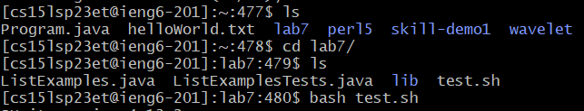

**JUnit Output**
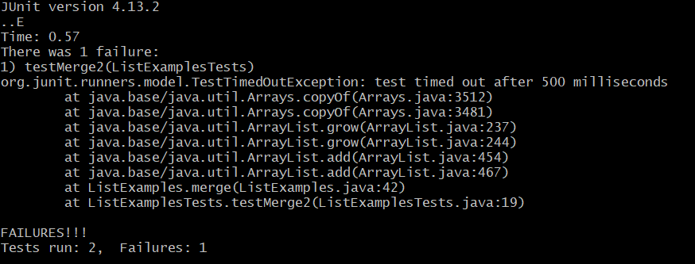

**Keystrokes**

```
ls<enter>cd<space>l<tab><enter>ls<enter>bash<space>test.sh<enter>
```

I navigated to `./lab7` and from there used the `bash` script `test.sh` which compiled everything and ran the `JUnit` tests. I hope you appreciate the tabs I used for super efficiency. Oh!! And one of the two tests ran is a `FAILURE!!!`!!!! I better fix that.........


## Step 7

**ListExamplesTests.java**

``` java
import static org.junit.Assert.*;
import org.junit.*;
import java.util.*;
import java.util.ArrayList;


public class ListExamplesTests {
        @Test(timeout = 500)
        public void testMerge1() {
                List<String> l1 = new ArrayList<String>(Arrays.asList("x", "y"));
                List<String> l2 = new ArrayList<String>(Arrays.asList("a", "b"));
                assertArrayEquals(new String[]{ "a", "b", "x", "y"}, ListExamples.merge(l1, l2).toArray());
        }

        @Test(timeout = 500)
        public void testMerge2() {
                List<String> l1 = new ArrayList<String>(Arrays.asList("a", "b", "c"));
                List<String> l2 = new ArrayList<String>(Arrays.asList("c", "d", "e"));
                assertArrayEquals(new String[]{ "a", "b", "c", "c", "d", "e" }, ListExamples.merge(l1, l2).toArray());
        }

}
```

So, It appears that the error occurs in `testMerge2`. There must be an error with the merge function that permits the first test to pass but not the second one???? What is it!!!!!???

**Opening `ListExamples.java` in `vim`** 
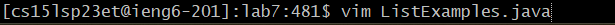

**`vim` editor containing bugged out `ListExamples.java`**
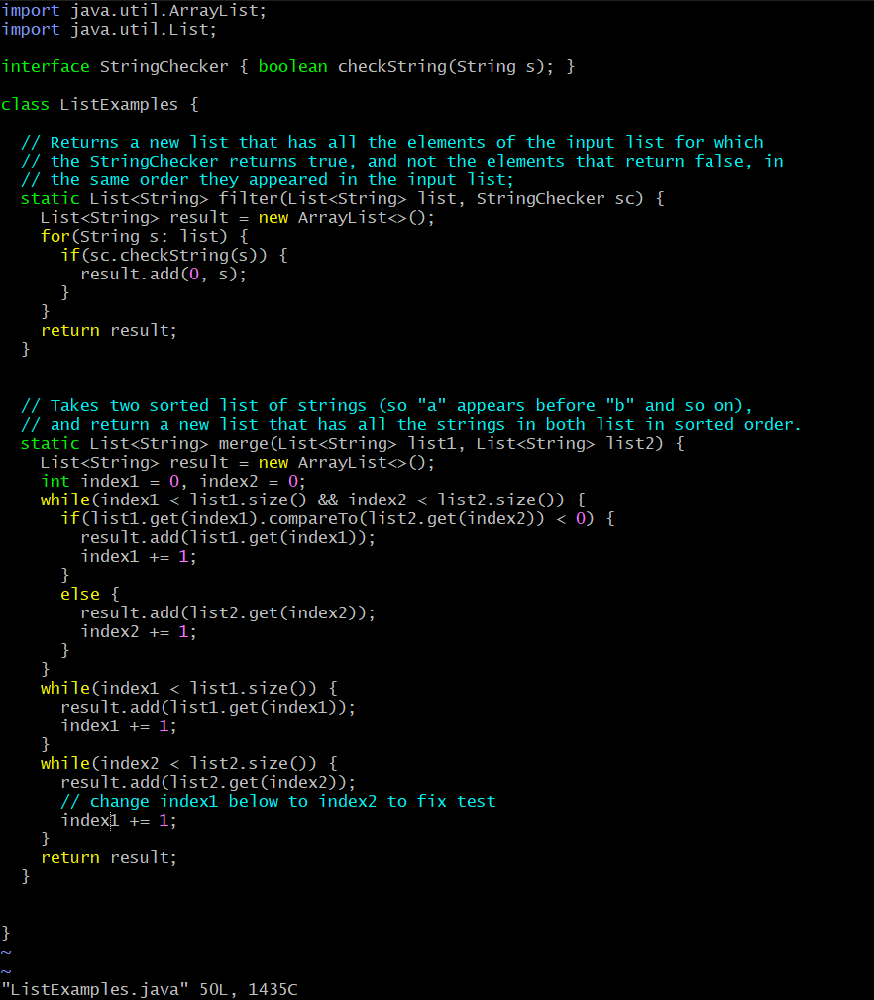

**`vim` editor after fixing the bug**
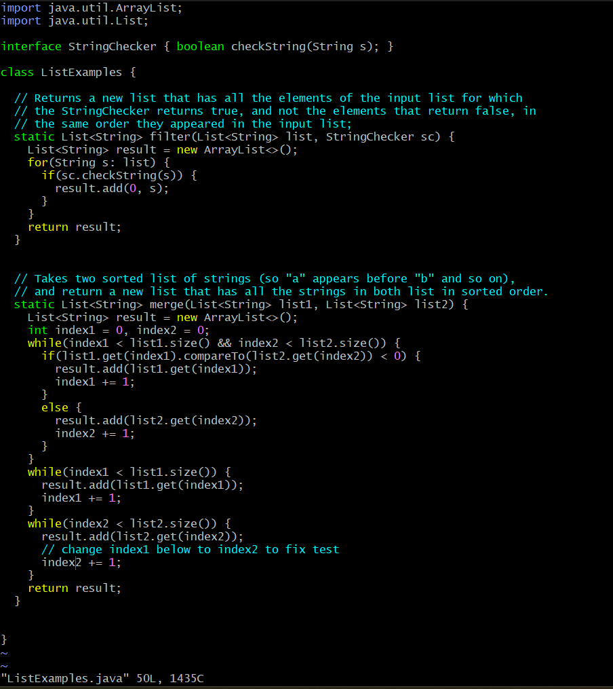

**Keystrokes**

```
vim<space><shift>list<shift>examples.java<enter>r2:wq<enter>
```

I opened up the bugged `ListExamples.java` with `vim`. Luckily, when I opened the file, my cursor was already on top of the `1` that causes the bug!!!! The darn incorrect index variable is breaking the test! So I just `r` to replace and `2` to fix the bug. Then `:wq` to save and quit. All better!

## Step 8

**`test.sh` Command**\
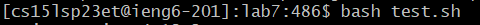

**`JUnit` Output**\
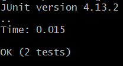


**Keystrokes**

```
bash<space>test.sh<enter>
```
Straightforward for this step. I ran the bash script and the two tests got `Ok`. I fixed her up! Like new polished nails!

## Step 9

**`git status` Command**\
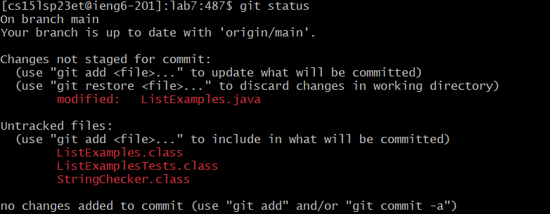

**`git add` Command**\


**`git commit` Command**\
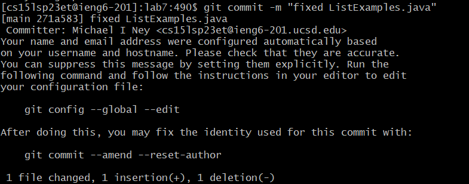

**`git push` Command**\
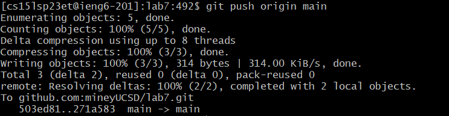

**Github Repository after `push`**\
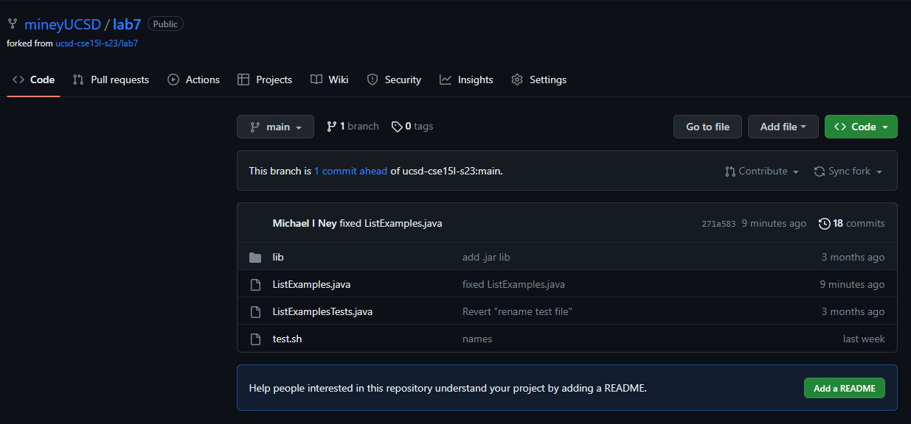

**Keystrokes**

```
git<space>status<enter>git<space>add<space><shift>list<shift>examples.java<enter>git<space>commit<space>-m<space><shift>'fixed<space><shift>list<shift>examples.java<shift>'<enter>git<space>push<space>origin<space>main<enter>
```
What a mouthfull of keystrokes! It was rather simple commiting and pushing, but including all of the `<shift>`s and `enter`s and `space`s makes the keystroke box cluttered as an alabaman attic! So, I used `git status` to make sure that I could `add` the changes I made to `ListExamples.java`. After that worked, I `add`ed the file and `commited` that with message `fixed ListExamples.java`. Then I `push`ed it to the `main` branch of my forked repository. Cut and dry, simple and clean, I think this is mission complete!, or concluded! 

